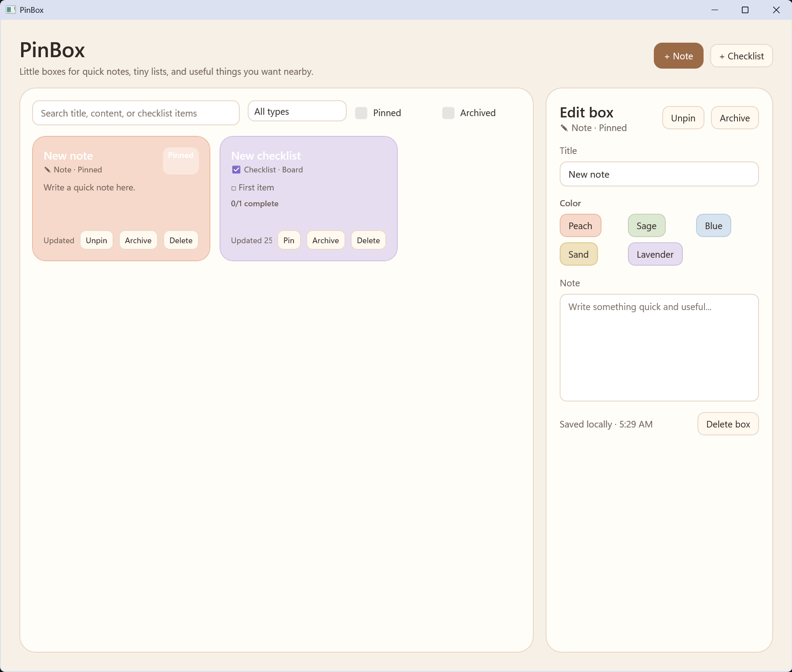

# PinBox

PinBox is a small local-first Windows app for simple notes and checklist-style boxes.

It is currently an early MVP. The goal is to keep the app lightweight, useful, and easy to understand rather than turning it into a complex productivity suite.



## Current status

PinBox is usable as an early local MVP, but it is still experimental.

The app currently focuses on:

- simple notes
- checklist notes
- local persistence
- basic search/filter behavior
- small, focused UI

## Features

- Create simple notes
- Create checklist notes
- Add, edit, toggle, and remove checklist items
- Search/filter notes
- Local saved state
- Basic startup hardening for saved data
- Defensive handling for some older or malformed local state

## Download

Go to the latest GitHub Release and download the Windows `.zip` build.

For example:

```txt
PinBox-v0.1.0-win-x64.zip
```

Then:

1. Extract the `.zip`
2. Run `PinBox.App.exe`

This is an unsigned early build, so Windows SmartScreen may show a warning.

If that happens, choose:

```txt
More info -> Run anyway
```

## Build from source

Requirements:

- Windows
- .NET 8 SDK
- Visual Studio 2022 or compatible .NET/Windows development tools

Clone the repo:

```powershell
git clone https://github.com/lkzMini/PinBox.git
cd PinBox
```

Build the solution:

```powershell
dotnet build .\PinBox.sln -c Release
```

Run the app from the Release output folder, for example:

```powershell
.\src\PinBox.App\bin\Release\net8.0-windows10.0.19041.0\PinBox.App.exe
```

## Creating a local zip build

After building in Release mode, the simplest early-MVP packaging method is to zip the Release output folder that contains `PinBox.App.exe`.

Example:

```powershell
$src = "D:\projects\PinBox\src\PinBox.App\bin\Release\net8.0-windows10.0.19041.0"
$out = "D:\projects\PinBox\artifacts\PinBox-v0.1.0-win-x64"

Remove-Item $out -Recurse -Force -ErrorAction SilentlyContinue
New-Item -ItemType Directory -Path $out | Out-Null

robocopy $src $out /E /XD publish /XF *.pdb

Compress-Archive `
  -Path "$out\*" `
  -DestinationPath "D:\projects\PinBox\artifacts\PinBox-v0.1.0-win-x64.zip" `
  -Force
```

Before publishing the zip, test it from a clean extracted folder:

```powershell
$test = "D:\projects\PinBox\artifacts\test-release"

Remove-Item $test -Recurse -Force -ErrorAction SilentlyContinue

Expand-Archive `
  -Path "D:\projects\PinBox\artifacts\PinBox-v0.1.0-win-x64.zip" `
  -DestinationPath $test `
  -Force

& "$test\PinBox.App.exe"
```

## Known limitations

- Early MVP
- Windows-focused
- No installer yet
- Unsigned executable
- No automated tests yet
- Packaging is currently a simple `.zip`
- The app may still change quickly between versions

## Privacy

PinBox is designed as a local-first app.

Current MVP behavior is focused on local saved state. It does not require an online account or cloud sync.

## Roadmap ideas

Possible future improvements:

- Better release packaging
- Optional installer/MSIX
- Improved visual polish
- More robust import/export
- Better keyboard shortcuts
- Automated tests
- More predictable filtering and sorting options

## License

This project is released under the MIT License.
